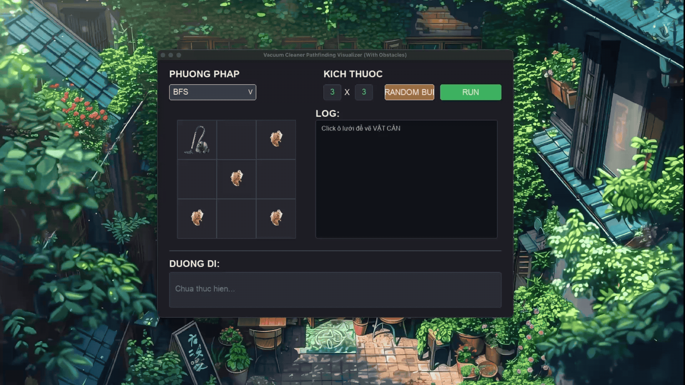

# <center>Project Cá Nhân</center>


## Github Link

[Artificial Intelligence - Nguyen Dinh Khanh](https://github.com/qilskcter/TriTueNhanTao)

## Source Code
- [Vacuum Cleaner](./VacuumCleaner/)
- [Tô Màu Bản Đồ](./ToMauBanDo/)

## Supported Algorithms

1. Uninformed Search

-  [BFS (Breadth-First Search)](./algorithms/bfs.py)
-  [BFS Early Goal Check](./algorithms/bfs_early.py)
-  [DFS (Depth-First Search)](./algorithms/dfs.py)
-  [DFS Early Goal Check](./algorithms/dfs_early.py)
-  [IDS (Iterative Deepening Search)](./algorithms/ids.py)
-  [IDS Early Goal Check](./algorithms/ids_early.py)
-  [UCS (Uniform Cost Search)](./algorithms/ucs.py)

2. Informed Search

-  [Greedy](./algorithms/greedy.py)
-  [A* (A-star)](./algorithms/A_star.py)
-  [IDA* (IDA-star)](./algorithms/ida_star.py)

3. Local Search

-  [Simple Hill Climbing](./algorithms/simplehillclimbing.py)
-  [Steepest Ascent Hill Climbing](./algorithms/steepestascenthillclimbing.py)
-  [Stochastic Hill Climbing](./algorithms/stochastichillclimbing.py)
-  [Random Restart Hill Climbing](./algorithms/randomrestarthillclimbing.py)
-  [Local Beam Search](./algorithms/localbeamsearch.py)
-  [Simulate Dannealing](./algorithms/simulatedannealing.py)

4. Search in Complex Environments

-  [Search in Partially Observable Environments](./algorithms/bfs_partial_early.py)
-  [Search in Unobservable Environments](./algorithms/bfs_unobservable.py)
-  [Search in Nondeterministic Environments](./algorithms/bfs_nondeterministic.py)
-  [And Or Graph Search](./algorithms/andorsearch.py)

5. Constraint Satisfaction Problem (CSP)

-  [Backtracking](./algorithms/backtracking.py)
-  [Forward-Checking](./algorithms/forward_checking.py)
-  [AC-3](./algorithms/ac3.py)
-  [Min Conflict](./algorithms/min_conflicts.py)

## Requirements

- Python 3.x
- Pygame
- Tkinter

## Project Structure

```
Project_ca_nhan
├── LinkGithub.txt
├── README.md
├── ToMauBanDo
│   ├── DATA
│   │   ├── Wards.json
│   │   └── provNew.geojson
│   ├── README.md
│   ├── algorithms
│   │   ├── ac3.py
│   │   ├── backtracking.py
│   │   ├── forward_checking.py
│   │   └── min_conflicts.py
│   ├── assets
│   │   └── demo.gif
│   └── main.py
└── VacuumCleaner
    ├── Assets
    │   ├── demo.gif
    │   ├── dirt.png
    │   ├── obstacle.png
    │   └── robot.png
    ├── README.md
    ├── algorithms
    │   ├── A_star.py
    │   ├── __init__.py
    │   ├── andorsearch.py
    │   ├── base.py
    │   ├── bfs.py
    │   ├── bfs_early.py
    │   ├── bfs_nondeterministic.py
    │   ├── bfs_partial_early.py
    │   ├── bfs_unobservable.py
    │   ├── dfs.py
    │   ├── dfs_early.py
    │   ├── greedy.py
    │   ├── ida_star.py
    │   ├── ids.py
    │   ├── ids_early.py
    │   ├── localbeamsearch.py
    │   ├── randomrestarthillclimbing.py
    │   ├── simplehillclimbing.py
    │   ├── simulatedannealing.py
    │   ├── steepestascenthillclimbing.py
    │   ├── stochastichillclimbing.py
    │   └── ucs.py
    └── main.py
```

## Demo 



## Installation & Running

1. Clone the repository:

```bash
git clone https://github.com/qilskcter/TriTueNhanTao.git
cd TriTueNhanTao
```

2. Install dependencies:

```bash
pip3 install tkinter
```

3. Run the application:

```bash
python3 main.py
```