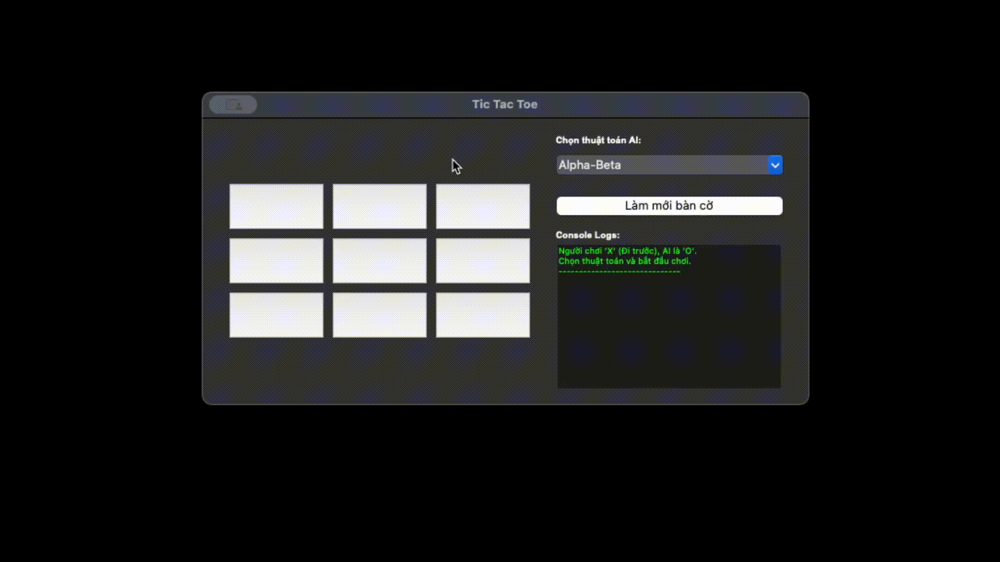

# <center>Tic-tac-toe</center>


## Github Link

[Artificial Intelligence - Nguyen Dinh Khanh](https://github.com/qilskcter/TriTueNhanTao)

## Supported Algorithms

6. Adversarial Search

-  [Minimax](./algorithms/minimax.py)
-  [Alpha-Beta](./algorithms/alphabeta.py)
-  [Expectimax](./algorithms/expectimax.py)

## Requirements

- Python 3.x
- Tkinter

## Project Structure

```
TicTacToe
├── README.md
├── algorithms
│   ├── __pycache__
│   │   ├── alphabeta.cpython-314.pyc
│   │   ├── expectimax.cpython-314.pyc
│   │   ├── minimax.cpython-314.pyc
│   │   └── utils.cpython-314.pyc
│   ├── alphabeta.py
│   ├── expectimax.py
│   ├── minimax.py
│   └── utils.py
└── main.py
```

## Demo 


## Installation & Running

1. Clone the repository:

```bash
git clone https://github.com/qilskcter/TriTueNhanTao.git
cd TriTueNhanTao
```

2. Install dependencies:

```bash
pip3 install tkinter
```

3. Run the application:

```bash
python3 main.py
```