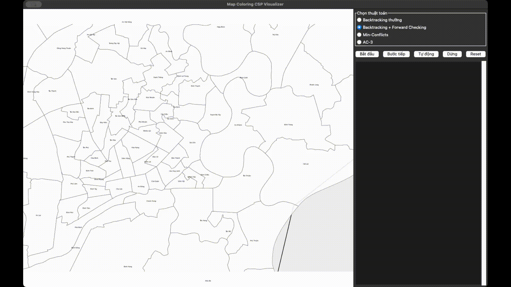

# <center>To Mau Ban Do</center>


## Github Link

[Artificial Intelligence - Nguyen Dinh Khanh](https://github.com/qilskcter/TriTueNhanTao)

## Supported Algorithms

5. Constraint Satisfaction Problem (CSP)

-  [Backtracking](./algorithms/backtracking.py)
-  [Forward-Checking](./algorithms/forward_checking.py)
-  [AC-3](./algorithms/ac3.py)
-  [Min Conflict](./algorithms/min_conflicts.py)

## Requirements

- Python 3.x
- Tkinter

## Project Structure

```
ToMauBanDo
├── DATA
│   ├── Wards.json
│   └── provNew.geojson
├── README.md
├── algorithms
│   ├── ac3.py
│   ├── backtracking.py
│   ├── forward_checking.py
│   └── min_conflicts.py
└── main.py
```

## Demo 


## Installation & Running

1. Clone the repository:

```bash
git clone https://github.com/qilskcter/TriTueNhanTao.git
cd TriTueNhanTao
```

2. Install dependencies:

```bash
pip3 install tkinter
```

3. Run the application:

```bash
python3 main.py
```